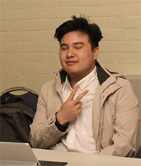

# My Portfolio
---

## Introduction

  

    
  

  

    
Hi, my name is Sebastian. I am 21 years old. I am studying Engineering, majoring in Software. I am in my fifth year.
    This is a picture of me!

  

### Motivations
I chose *IoT Product Development* as I already had some familiarity in working with IoTs through a subject earlier on in my course. I figured that because of this familiarity, I would be able to have fun applying my learnings creatively, rather than struggling with just learning to bring something to the bare minimum. The technology itself was of interest to me, as I have been exploring real-time communications technology in software for a while out of my own volition, and as a potential space for my capstone project later in 2019.

### Objectives
I would like to deepen my understanding of IoT product design, not just conceptually, but technically and practically. I believe that by understanding the architecture and design of IoT solutions. I want to have enough of an understanding to confidently propose IoTs in a solution to clients in the future, should the need arise.

## Learning Contract
### Learning Goals
- Learn more about the real-time technologies used in IoT systems, such as MQTT and the ESP8266 WiFi MCU.
- Apply said technologies so consolidate my understanding
- Learn about containerisation of code for deployments via. Docker and how to do it
- Re-learn more about programming microcontrollers (I did one subject on it, but it was in my second year)
- Re-learn electronics (I did introductory subjects in my first couple of years)

### Group Strategy
I know a bit on the software side (programming, configuring, and deploying backend code as a server), so I hope I can use my skills to help others in handling data in the cloud.

I know next to nothing about hardware and electronics, despite having learned it in my degree early on (it isn't the focus of my major), it has been such a long time that I have forgotten. I will need to collaborate with others to make up for it, also by observing those with more experience, I may learn faster!

I will use Microsoft Teams to share information and collaborate with other people in my class remotely.

### Resources & Strategies
- I will read the documentation on things such as MQTT and the ESP mcu, and attempt to implement a bit of it myself, following code examples and tutorials to start.
- I will try to containerise my server-side deployments of code.
- I will observe and collaborate with those around me so I can learn from them, and hopefully they can learn something from me.

### What is to be Assessed
My deliverables for this studio are:
1. Design and develop a solution using IoT technology
2. Get a server in the cloud running to connect IoT devices
3. Program a microcontroller to the device I am making so that it can connect with the cloud
4. Create a small-scale prototype of the solution