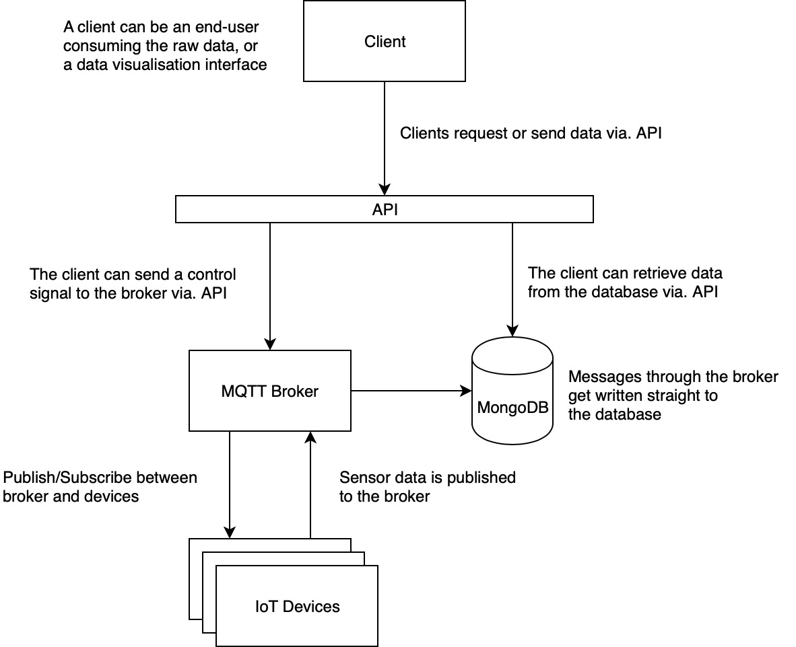
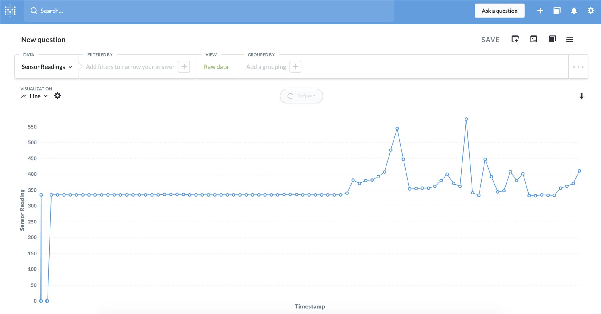
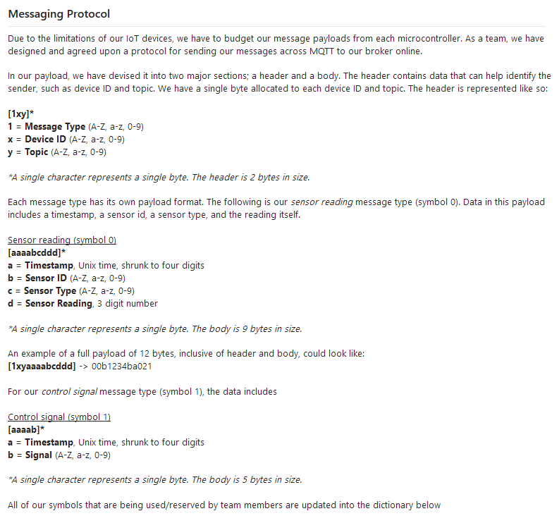
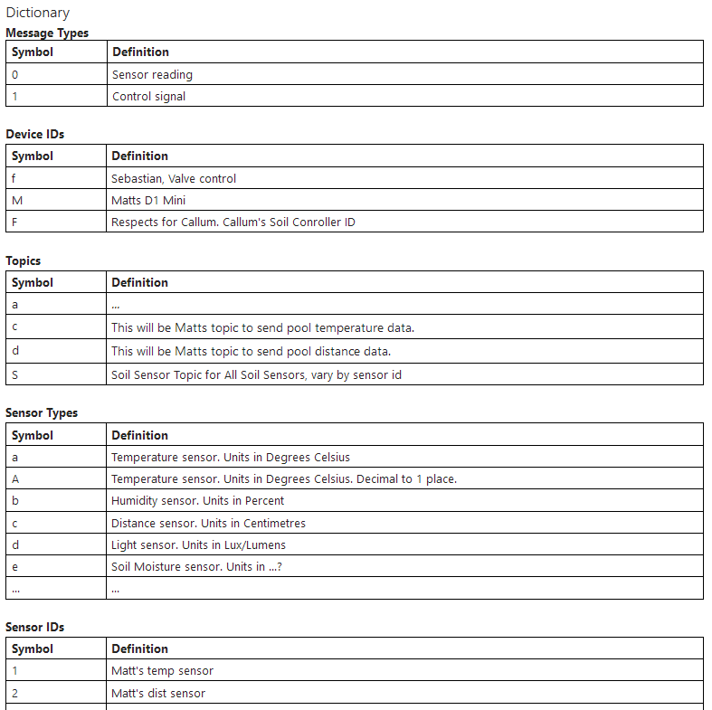
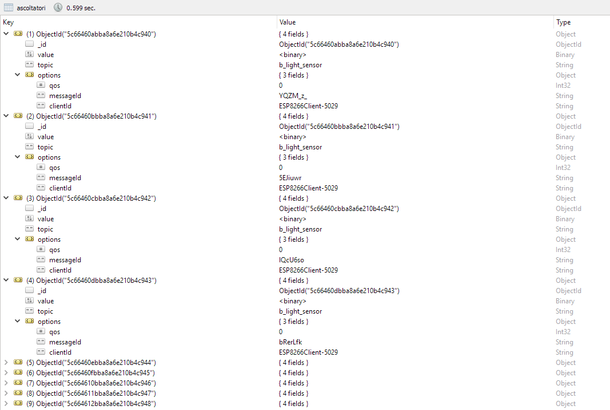
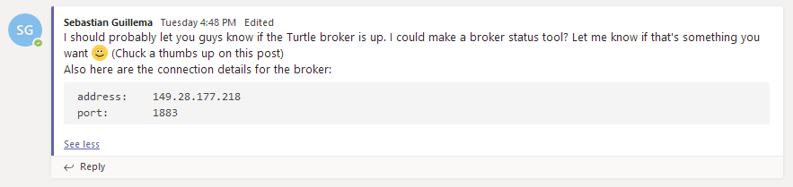
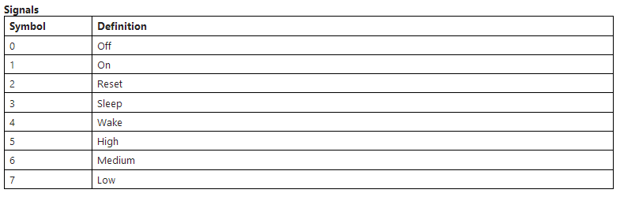
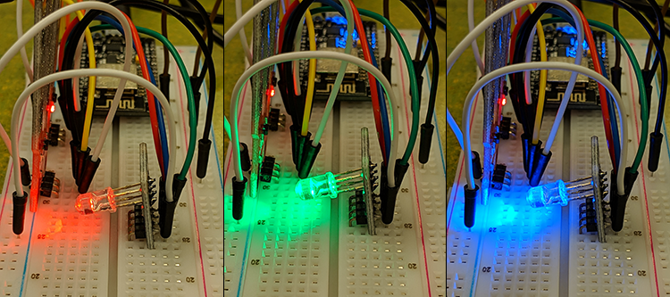

# Blog
---
During Summer Studio B, we were tasked to work in correspondence to agile project methodology. This means we divided our work into the concept of 'sprints'.

In these sections, I will reflect on my experience throughout each sprint and attach some artifacts as evidence to my learnings.

## Sprint 1
I built an [IoT Data Logger](http://iot.nortcele.win/doc/index.html), components and schematics provided by courtesy of the studio's tutor, Danon. We were introduced to some of the IoT technologies we will be working with. These included a WiFi microcontroller unit, [ESP8266](https://arduino-esp8266.readthedocs.io/en/latest/index.html), and a piece of software called Blynk. I am working on a project with another person, Callum. **We are addressing the maintenance of small potted plants through the use of IoTs. Our current concept is a soil moisture sensor that is remote, and can initiate a watering procedure should the soil moisture reach below a certain threshold.**

I have built this portfolio this week. The repository is accessible through the artifacts in this entry. I have allowed other students in my studio to use and fork this repository to help speed up making their own portfolios. The portfolio is a website using [Vuepress](https://vuepress.vuejs.org), and is deployed using the CI/CDN service known as [Netlify](https://netlify.com). I have linked the site to domain registered by our tutor https://summerstudio.xyz. This portfolio currently resides on the subdomain <https://sebastian.summerstudio.xyz> (which is this site!).

I explored a communication protocol used in IoT devices called [MQTT](http://mqtt.org/) (MQ Telemetry Transport). Without getting into the specifics, MQTT allows machines to communicate with one another in real-time. It requires a 'broker' server to handle the communication between clients. I have developed an MQTT broker locally in NodeJS using a library called [Mosca](https://github.com/mcollina/mosca) and am intending on deploying it in the cloud for machines to access via. the internet. The MQTT broker I have is connected to [MongoDB](https://www.mongodb.com/), which is a non-relational database. The database is being hosted on the cloud, and I am using [mLab](https://mlab.com/) for hosting this database. I already have an account on there, so I just used that to spin up a new database. Our tutor, Danon, has some online compute instances available for us to use in the case we want to host anything on the cloud. It is attached to an infrastructure-as-a-service called [Vultr](https://www.vultr.com). The repository for what I have done for the broker currently is in the artifacts for this sprint. I will learn more about Docker so that I can containerise future deployments of the server, rather than setting up virtual machines manually to host my code. At this sprint, I've deployed my code to my Vultr instance, called "Turtle". I did this by SSH (Secure Shell) terminal. Once inside the instance, which has Ubuntu, I installed git using `apt-get install git-core`. I went ahead and updated any existing OS packages with `apt-get install`. The next step I had was to install Nodejs on turtle so I could run the Mosca server code. I did this by executing the following lines inside of the SSH terminal.
```
curl -sl https://deb.nodesource.com/setup_11.x | sudo -E bash -
sudo apt-get install -y nodejs
```
Once I had done this, I created a directory inside of the instance and cloned my backend repo into there.
```
cd
mkdir projects
cd projects
git clone https://github.com/sguillema/ssb19_iot_be
```
Before I run the server, there is one thing I need to do, and that's to create a config file that **wasn't** committed into the backend repo. This repo contains the credentials to access the database that is storing the MQTT broker's data. The reason I do not commit this online is due to security. With that said, I manually created a config file using vim in terminal. I added in my credentials then saved the config.


After that, I ran the server.
```
npm i
node app
```
This is the output in terminal:


After all of that, I built a prototype that blinks an LED if it receives a message from a topic that it is subscribed to from the MQTT broker. I am writing to the ESP8266 mcu using something called [Platform.io](https://platformio.org/) via. USB cable -- it is an alternative IDE for programming Arduino compatible boards. The prototype is connected to my phone's hotspot and the MQTT server I set up. The repo for this code is available in the artifacts section of this sprint.
```c
const char* ssid = "Seb's phone";
const char* password = "******";
const char* mqtt_server = "149.28.177.218";
```
*Above: Some constants used for connectivity in the programming of the ESP8266 mcu*

*Below: Callback function for blinking the built-in LED on the ESP8266 module*
```c
void callback(char* topic, byte* payload, unsigned int length) {
  Serial.print("Message arrived [");
  Serial.print(topic);
  Serial.print("] ");
  for (int i = 0; i < length; i++) {
    Serial.print((char)payload[i]);
  }
  Serial.println();

  digitalWrite(BUILTIN_LED, HIGH);
  delay(1000);
  digitalWrite(BUILTIN_LED,LOW);
  delay(1000);
}
```

At the moment, it is receiving data that is coming from a soil moisture sensor, set up by Callum. The data from his sensor is being published to the MQTT broker I had previously made. I am using the ESP8266 module already on my IoT Data Logger for this. The current prototype blinks the built-in LED on the module. I hope to develop this further in future sprints to control a mechanism from which water can be distributed to a potted plant.

```
--- Miniterm on /dev/cu.usbserial-1420  9600,8,N,1 ---
--- Quit: Ctrl+C | Menu: Ctrl+T | Help: Ctrl+T followed by Ctrl+H ---
Message arrived [SoilSensor1] 000
```
*A log from the ESP module upon receiving a message*

#### Additional Artifacts
> Portfolio <https://github.com/sguillema/ssb19_iot_portfolio/tree/sebastian>

> Backend Repo - MQTT Broker <https://github.com/sguillema/ssb19_iot_be>

<!-- > MQTT broker and client working locally  -->

> IoT Device Repo <https://github.com/sguillema/ssb19_iot_device>

## Sprint 2
This week I further developed my work on the MQTT broker, called Turtle, which I established last week. I worked alongside my team to help deliver infrastructure to support our IoT devices and projects in this studio. The intrastructure is based off the following model. I created the diagram using [Draw.io](https://draw.io/).



To deliver this system, the work was divided amongst my group members. Each being responsible over different (and sometimes the same) parts of the system. I worked primarily on the **MQTT Broker, database (MongoDB), and the API layer**. Fortunately, the work I had done in the previous sprint had eased these aspects of the solution as they already existed, and only needed to be updated and refactored to properly integrate with other parts.

I worked on the API layer with Callum a bit early in the week, helping him set up some parts of it, as he has not built an API before. I walked him through using Amazon Web Services' Lambda Functions and API Gateway to create an API for members to use in order to access data from the database and to send control signals to the broker. Unfortunately accessing the database via. API was not necessary was we moved to an analytics software called [Metabase](https://www.metabase.com/). Metabase could connect to our MongoDB database to create queries and display them visually. Here is a screenshot of when we first linked it.



Before we could actually link the data straight to metabase though, our data had to be properly formatted in the database. My team had a meeting to establish a protocol for our messaging services to consolidate our budget for messaging (IoT devices are low power, and as a result cannot afford to send big packets so often) and also so that data could be universally interpreted, no matter what device or sensor type. A key decision in our data structure were the following factors:
- We should share the same collection in our database
- We would all use the same broker for out IoTs
- Data would be filtered out by a key representing our IoT devices

After consulting everyone for how many digits their readings would take, we came to a rough first draft of our messaging protocol. It would later be developed into a Wiki on our Microsoft Team from which we could freely modify, as we would need to update definitions as we went.


*Above: The messaging protocol at the end of sprint 2*


*The symbol dictionary the team created; to make sure we did not overlap our data*

From the previous sprint, the broker automatically writes to our database inside of a collection with the following data:



This feature from the broker library I was using was automatic. There was no way to manipulate the data in that collection. The solution for this was to simply write to another collection (in this case, it was called sensor readings) in a structure the team could use whenever the broker received information in the correct format (according to our messaging protocol).

```javascript
// fired when a message is received
server.on('published', function(packet, client) {
  console.log('Published', packet.payload)
  if (packet.payload) {
    /** Create our object that will be stored in our DB */
    let entry = new SensorReading({
      deviceId: '0',
      topic: 'a',
      timestamp: new Date(),
      sensorId: 'a',
      sensorType: 'a',
      sensorReading: 000
    })
    /** Write our object as a document in the DB */
    SensorReading(entry).save().then(res => {
      console.log('Entry written to DB')
    })
  }
})
```

::: warning Note
Unfortunately I wiped the database before I wrote this portfolio entry, and nobody has logged data since (I wiped it after the day ended), so I don't have a picture to show the updated data inside of the database. We did however showcase it to the class at the end of the week anyways, before I wiped everything.
:::

After that, I did some more optimisation work for the broker, automating its startup, and also providing a reset script. I did this by creating some shell files via. vim while I was SSH'd into the turtle virtual machine. Earlier on in the week, I noticed that the team was testing locally a bit due to them not knowing when the broker was up. I didn't communicate when the broker was running, and even then, I accidentally closed it by killing the terminal process that was SSH'd to the turtle vm. Upon that, I posed a question to my team if they wanted to have a tool to check the status of the server.


*Sadly nobody reacted* :(

They said in person that it would be handy for them, so I went ahead and did it. After refactoring the broker to now be a module in another server, my team members could now check the status of the server by doing a call to a `/status` endpoint. As a little bonus, I also incorporated the functionality to reset the broker remotely using the `/reset` endpoint, should it somehow go down. Because of this, the team could now have control over the broker's availability and see it themselves when they need it.
```javascript
let server // This is our mosca server variable

/** Classic endpoint :) */
app.get('/', (req, res) => res.send('Hello World!'))

/** GET - Check the broker status */
app.get('/status', (req, res) => {
  let tempApp = express().listen(settings.port, () => {
    res.send({
      val: false,
      msg: 'Broker is NOT running. You may restart it by doing a GET request to \'/reset\'\n'
    })
    tempApp.close()
  }).on('error', (err) => {
    res.send({
      val: true,
      msg: 'Broker is up and running! You may restart it by doing a GET request to \'/reset\'\n'
    })
    tempApp.close()
  })
})

/** GET - Reset the broker */
app.get('/reset', (req, res) => {
  try {
    server.close()
    main()
    res.send({
      msg: 'Restarting MQTT Broker \n'
    })
  } catch(err) {
    res.send({
      msg: 'Failed to start MQTT Broker. Reason: '+err
    })
  }
})

app.listen(port, () => {
  console.log(`Server listening on ${port}!`)
  main()
  console.log(`Mosca MQTT broker running on ${settings.port}`)
})

function main() { 
console.log(`Starting Mosca server...`)
// MQTT broker lives in this block of code
}
```

Because some members of the team required remote control signals functionality (mostly me), I needed to implement it. We had to update our procotol to differentiate message types using the **first** byte of the packet payload sent over. This was updated both on the devices and the broker. Furthermore, we updated our dictionary to include some control signals we believed may be used.


*Above: Draft of control signal definitions*

```javascript
let payload = packet.payload.toString()
let entry
switch (payload[0]) {
  case messageType.sensorReading : {
    /** Create our object that will be stored in our DB */
    entry = new SensorReading({
      // Sensor reading data
    })

    /** Write our object as a document in the DB */
    SensorReading(entry).save().then(res => {
      console.log('Sensor Reading entry written to DB')
    })
  }

  case messageType.controlSignal : {
    /** Create our object that will be stored in our DB */
    entry = new ControlSignal({
      messageType: payload[0],
      deviceId: payload[1],
      topic: payload[2],
      timestamp: new Date(), // payload.slice(3, 7)
      signal: payload[7]
    })

    /** Write our object as a document in the DB */
    ControlSignal(entry).save().then(res => {
      console.log('Control Signal entry written to DB')
    })
  }

  default : {
    console.log(`Unknown payload ${packet.payload}`)
  }
}
```
*Updated payload handling, using a switch-case for the different message types*


The next thing I did was then address an issue of junk data being received and placed inside of the database. This happened because I originally had set the broker to process any packet payload that came through that wasn't type Null. I updated the broker to handle this.

```javascript
if (packet.payload && Buffer.isBuffer(packet.payload)) {
  //...
}
```
*Condition now also checks if the payload's type is a byte array (aka buffer)* 

The last change I made to the broker in the sprint was to process sensor reading values that needed a decimal point somewhere. Our messaging procotol only takes 3 digits, all of which are to be numbers. So if there was any decimal point in the original reading, the sender would need to omit it before sending the payload (they can just multiply their number by 10^n for example). Again, the reasoning for this is to maintain our standard, and to minimise byte wastage. Now, the problem with this was that the 3-digit number would be written straight into the database, this meant some data representations would have their results multipled by however amount. To fix this. the broker needed to place this decimal back correctly before writing the reading to the DB. Fortunately, we could determine if this was needed just by looking at the sensor type symbol in the packet payload we received. Here is code providing this functionality:

```javascript
let formattedReading = Number(payload.slice(9, 12))

switch (payload[8]) {
  case sensorType.temperature1dec : {
    formattedReading = parseFloat(formattedReading.toString().slice(0,2)+'.'+formattedReading.toString().slice(2))
  }
}
```
*We know to check the 9th byte of our payload, because that's what we defined in our message protocol as being the indicator for sensor type*

Lastly in the sprint, I worked on my physical prototype. I moved away from the IoT Datalogger I made last week, and worked with an ESP Dev board, which had a micro-usb port for flashing the firmware. With some help from Callum, we made a messy but quick implementation of control signal processing on the ESP mcu using the broker to handle a remote message from another machine (using an MQTT client) to change the colour of an RGB LED.


*Signal: 1 = Red, 2 = Green, 3 = Blue*

Overall, it was a good week of progress :tada::tada:. Hopefully by having this infrastructure set up, everyone's work on in my team on their physical devices can be accelerated.

Hopefully next week I will receive the water pump I requisitioned. I will attempt to control it via. remote control signal, using data from the soil moisture sensors as a catalyst. I will also properly implement the messageing protocol for recieving control signals on the devices, as for the prototype this sprint, it was ad hoc and did not follow the protocol.


#### Additional Artifacts
> Team Leonidas Wiki <https://teams.microsoft.com/l/channel/19%3A31be4fdb77534283845d9eadbd0791d8%40thread.skype/tab%3A%3A0a02e5f4-89e4-476e-a099-4ec1c69606c9> (Requires access to Microsoft Teams)


<!-- ## Sprint 3

#### Artifacts -->

<!-- ## Sprint 4

#### Artifacts -->