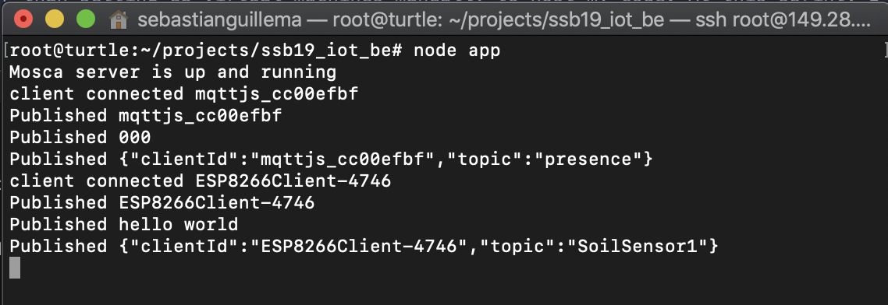
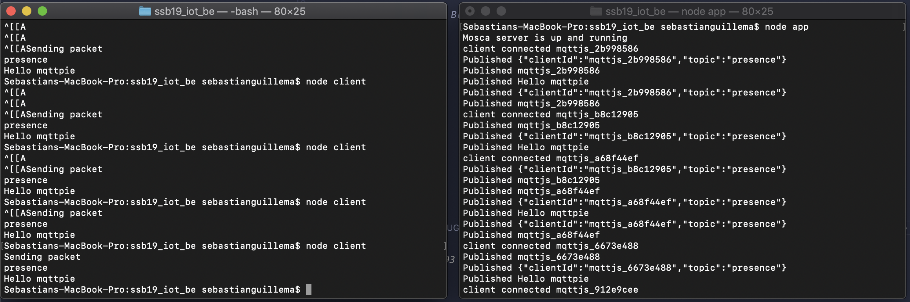

# Blog
---
During Summer Studio B, we were tasked to work in correspondence to agile project methodology. This means we divided our work into the concept of 'sprints'.

In these sections, I will reflect on my experience throughout each sprint and attach some artifacts as evidence to my learnings.

## Sprint 1
I built an [IoT Data Logger](http://iot.nortcele.win/doc/index.html), components and schematics provided by courtesy of the studio's tutor, Danon. We were introduced to some of the IoT technologies we will be working with. These included a WiFi microcontroller unit, [ESP8266](https://arduino-esp8266.readthedocs.io/en/latest/index.html), and a piece of software called Blynk. I am working on a project with another person, Callum. **We are addressing the maintenance of small potted plants through the use of IoTs. Our current concept is a soil moisture sensor that is remote, and can initiate a watering procedure should the soil moisture reach below a certain threshold.**

I have built this portfolio this week. The repository is accessible through the artifacts in this entry. I have allowed other students in my studio to use and fork this repository to help speed up making their own portfolios. The portfolio is a website using [Vuepress](https://vuepress.vuejs.org), and is deployed using the CI/CDN service known as [Netlify](https://netlify.com). I have linked the site to domain registered by our tutor https://summerstudio.xyz. This portfolio currently resides on the subdomain <https://sebastian.summerstudio.xyz> (which is this site!).

I explored a communication protocol used in IoT devices called [MQTT](http://mqtt.org/) (MQ Telemetry Transport). Without getting into the specifics, MQTT allows machines to communicate with one another in real-time. It requires a 'broker' server to handle the communication between clients. I have developed an MQTT broker locally in NodeJS using a library called [Mosca](https://github.com/mcollina/mosca) and am intending on deploying it in the cloud for machines to access via. the internet. The MQTT broker I have is connected to [MongoDB](https://www.mongodb.com/), which is a non-relational database. The database is being hosted on the cloud, and I am using [mLab](https://mlab.com/) for hosting this database. I already have an account on there, so I just used that to spin up a new database. Our tutor, Danon, has some online compute instances available for us to use in the case we want to host anything on the cloud. It is attached to an infrastructure-as-a-service called [Vultr](https://www.vultr.com). The repository for what I have done for the broker currently is in the artifacts for this sprint. I will learn more about Docker so that I can containerise future deployments of the server, rather than setting up virtual machines manually to host my code. At this sprint, I've deployed my code to my Vultr instance, called "Turtle". I did this by SSH (Secure Shell) terminal. Once inside the instance, which has Ubuntu, I installed git using `apt-get install git-core`. I went ahead and updated any existing OS packages with `apt-get install`. The next step I had was to install Nodejs on turtle so I could run the Mosca server code. I did this by executing the following lines inside of the SSH terminal.
```
curl -sl https://deb.nodesource.com/setup_11.x | sudo -E bash -
sudo apt-get install -y nodejs
```
Once I had done this, I created a directory inside of the instance and cloned my backend repo into there.
```
cd
mkdir projects
cd projects
git clone https://github.com/sguillema/ssb19_iot_be
```
After that, I ran the server.
```
npm i
node app
```
This is the output in terminal:



After all of that, I built a prototype that blinks an LED if it receives a message from a topic that it is subscribed to from the MQTT broker. I am writing to the ESP8266 mcu using something called [Platform.io](https://platformio.org/) via. USB cable -- it is an alternative IDE for programming Arduino compatible boards. The prototype is connected to my phone's hotspot and the MQTT server I set up. The repo for this code is available in the artifacts section of this sprint.
```c
const char* ssid = "Seb's phone";
const char* password = "******";
const char* mqtt_server = "149.28.177.218";
```
*Above: Some constants used for connectivity in the programming of the ESP8266 mcu*

*Below: Callback function for blinking the built-in LED on the ESP8266 module*
```c
void callback(char* topic, byte* payload, unsigned int length) {
  Serial.print("Message arrived [");
  Serial.print(topic);
  Serial.print("] ");
  for (int i = 0; i < length; i++) {
    Serial.print((char)payload[i]);
  }
  Serial.println();

  digitalWrite(BUILTIN_LED, HIGH);
  delay(1000);
  digitalWrite(BUILTIN_LED,LOW);
  delay(1000);
}
```

At the moment, it is receiving data that is coming from a soil moisture sensor, set up by Callum. The data from his sensor is being published to the MQTT broker I had previously made. I am using the ESP8266 module already on my IoT Data Logger for this. The current prototype blinks the built-in LED on the module. I hope to develop this further in future sprints to control a mechanism from which water can be distributed to a potted plant.

```
--- Miniterm on /dev/cu.usbserial-1420  9600,8,N,1 ---
--- Quit: Ctrl+C | Menu: Ctrl+T | Help: Ctrl+T followed by Ctrl+H ---
Message arrived [SoilSensor1] 000
```
*A log from the ESP module upon receiving a message*

#### Artifacts
> Portfolio <https://github.com/sguillema/ssb19_iot_portfolio/tree/sebastian>

> Backend Repo - MQTT Broker <https://github.com/sguillema/ssb19_iot_be>

<!-- > MQTT broker and client working locally  -->

> IoT Device Repo <https://github.com/sguillema/ssb19_iot_device>

<!-- ## Sprint 2

#### Artifacts

## Sprint 3

#### Artifacts

## Sprint 4

#### Artifacts -->